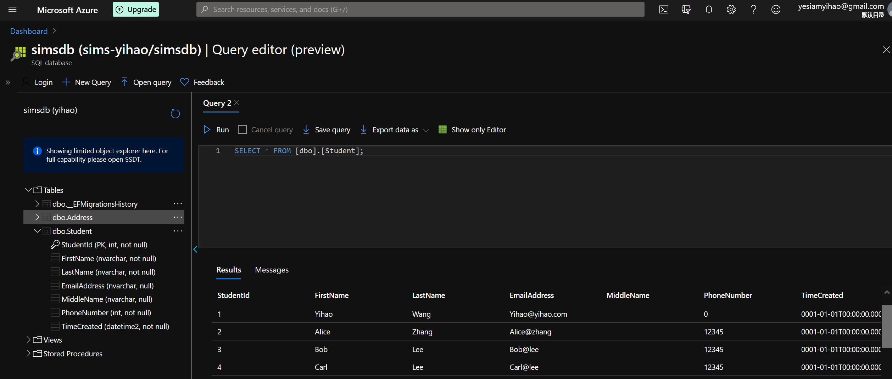
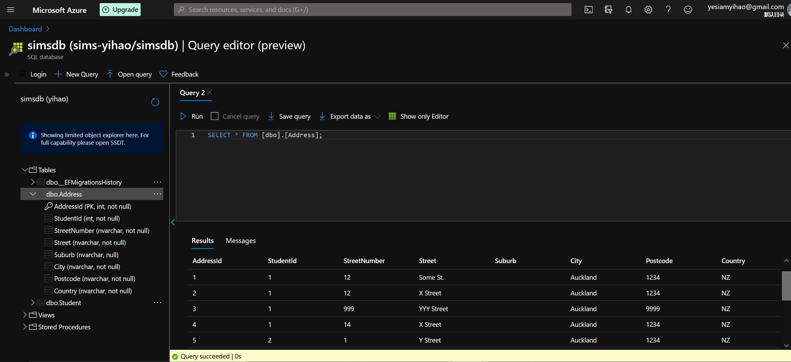
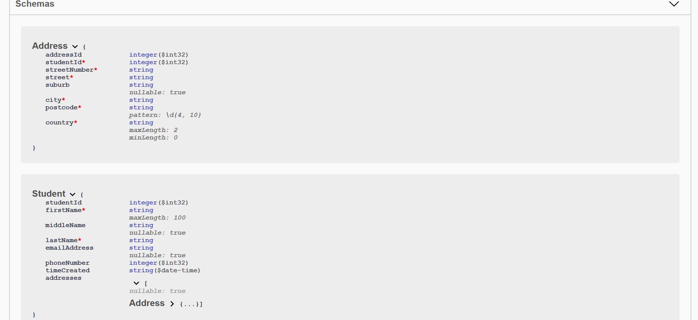
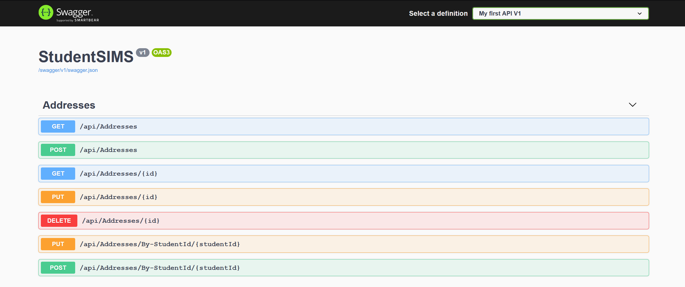
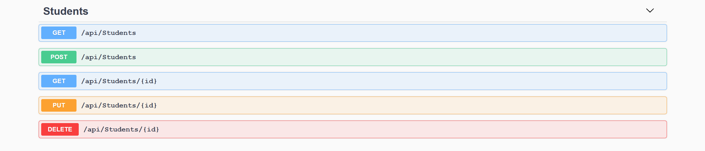

# StudentSIMS
This is the project code for the NZMSA - Phase 1 - Databases and api.
This project has been deployed to Azure, accessable via [this link](https://yihao-studentsims.azurewebsites.net/).

> Author: Yihao Wang

> Date of completion: 2020-7-9

## Database

The database contains two tables: `Student` and `Address`.

The `Student` table is unchanged from the sample code. Here is the schema and sample data of `Student` on Azure Query editor:

The `Address` table is newly created. Here is the schema and sample data of `Address`:

Some explanations:
- An `AddressId` field has been added to serve as the primary key.
- `StreetNumber` and `Postcode` fields are implemented as strings instead of ints, in order to handle some corner cases, such as street numbers containing letters, and postcodes starting with zeros.
- By adding a field `Addresses` of the type `List<Address>` in `Models/Student.cs`, the `StudentId` field of `Address` is made a foreign key referencing `StudentId` of `Student`. This represents a one-to-many relationship.

## APIs

There are two categories of APIs: `/api/Students/*` and `/api/Addresses/*`. When used with `GET` requests, they return the JSON representations of `Student` and `Address` objects, respectively.
The JSON schemas can be viewed on SwaggerUI:

The list of all APIs are as follows:

Some explanations:
- The five APIs for `/api/Students` are auto-generated by Visual Studio. Likewise, five of the seven APIs for `/api/Addresses` are auto-generated.
- Two additional APIs are created for `/api/Addresses`: PUT: `/api/Addresses/By-StudentId/{studentId}`, POST: `/api/Addresses/By-StudetnId/{studentId}`. They update and create addresses corresponding to specified student ids, respectively.
- Because a `Student` JSON has an array of `Address` JSONs embedded, this needs some special treatment when 'PUT' or 'POST' a `Student`. When creating('POST') a student, any embedded addresses are also created and added to this student. When updating('PUT') a student, on the other hand, the embedded address must be `null`, or a `400` result is generated. If one needs to update the address, the addresses APIs should be used instead.
